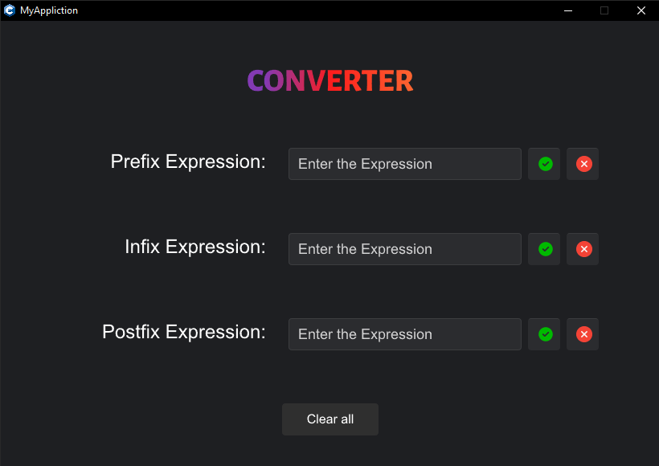

# Converter

A simple converter application that transforms **prefix**, **infix**, and **postfix** expressions into each other. Built
using the [Slint](https://github.com/slint-ui/slint) library for UI representation.

## Screenshot



## Prerequisites

Before building or running this project, ensure you have the following dependencies installed:

- C++20 compatible compiler (e.g., GCC 10+, Clang 10+, or MSVC 19.29+)
- [Rust](https://www.rust-lang.org/tools/install) (1.82 or higher)
- [CMake](https://cmake.org/documentation/) (3.30 or higher)
- [Slint](https://github.com/slint-ui/slint)
- [Ninja](https://ninja-build.org/) (if you're not building for Visual Studio)

## Building the Project

### Clone the Repository

Start by cloning the project from the GitHub repository:

```bash
# Clone the Repository
git clone -j8 https://github.com/Spike271/Converter.git
```

### For Windows (Visual Studio)

1. Generate build files:
   ```bash
   cmake -B build
   ```

2. Build the project:
   ```bash
   cmake --build build -j8 --config Release
   ```

### For Other Platforms (Also works for Windows)

1. Create and navigate to the build directory:
   ```bash
   mkdir build
   cd build
   ```

2. Generate the build system files using Ninja:
   ```bash
   cmake -G "Ninja" -D CMAKE_CXX_COMPILER=g++ -D CMAKE_BUILD_TYPE=Release ..
   ```

3. Build the project:
   ```bash
   ninja
   ```

## Warning for Windows Users

During the build process on Windows, Windows defender can take down some files that can cause the build to fail.

### What You Can Do:

1. **Whitelist the Build Folder:**
   Add the build folder as an exception in Windows Defender to avoid interruptions.
---

## Usage

1. Launch the application after building
2. Select the input format (prefix, infix, or postfix)
3. Enter your expression in the input field
4. Select the desired output format
5. The converted expression will be displayed automatically

### Example Conversions

Infix to Prefix:

- Input: `a + b * c`
- Output: `+ a * b c`

Infix to Postfix:

- Input: `a + b * c`
- Output: `a b c * +`

### Supported Operations

- Basic arithmetic operations (+, -, *, /, ^)
- Parentheses for grouping in infix notation
- Single-character operands (a-z, A-Z, 1–9)

### Limitations

- Only single-character operands are supported
